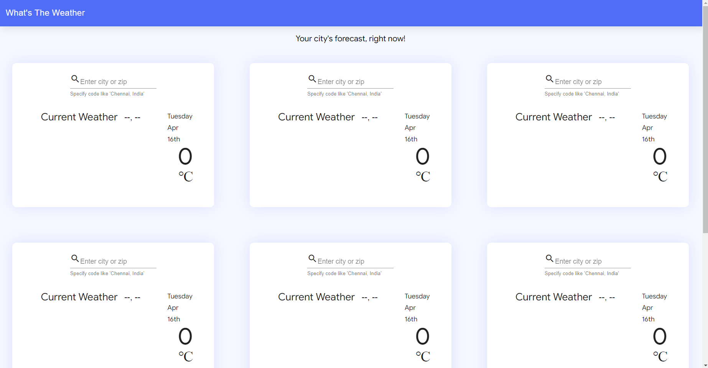
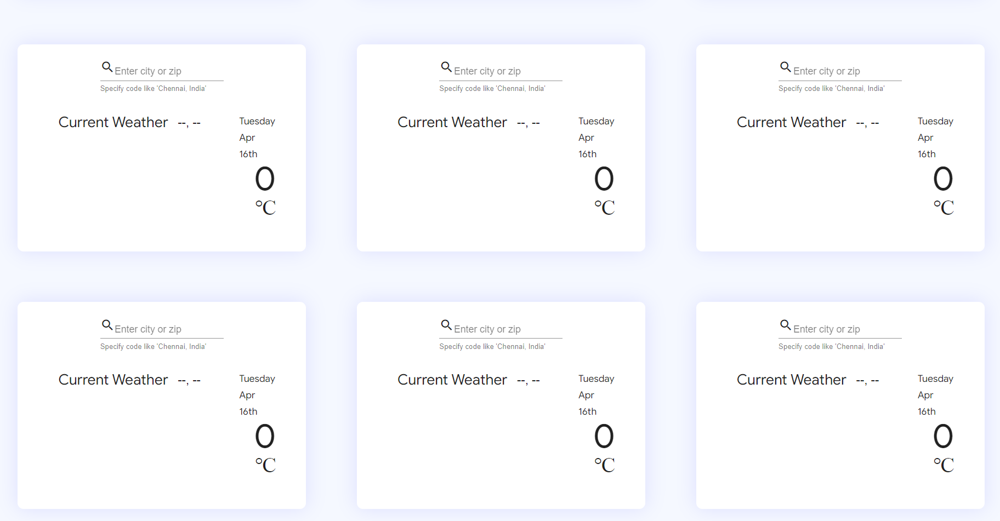

# whatstheweather 

To run this project locally do the folllowing steps:

1. Fork this repository
2. then clone your fork repository
3. go to your repository
```console 
cd <repository_name>
```
4. install npm using
```console 
npm install
```
5. To run use 
```console 
ng serve 
```
6. type http://localhost:4200/ into your browser to run it locally
<br>
<br>

# Task Tick mark

- [x] 1. The app consists of a grid of 9 panels. Every panel shows the weather data of one city. Initially, all panels would be empty.
- [x] 2. On clicking on an empty panel, a text box is shown on the panel itself, asking the user to enter the city name. On entering the name, the panel now shows weather data for that city.
<!--- [ ] 3. Every panel should have an “Edit” button - on clicking this, the user should be able to change the city shown in that panel.-->
- [x] 3. Every panel has a background picture that describes the weather at the city eg. sunny/rainy/cloudy.
- [x] 4. The panels should be in a grid and responsive - the panels should align themselves in a row with respect to the screen size: for small screens - less number of panels in a row and for large screens - more number of panels in a row.
<!--- [ ] 6. If there was an error in getting the data (eg. wrong city name), the panel itself shows the error and the user can re-enter the city name. 
```console 
Partially true
```-->
- [x] 5. The weather data must be updated regularly - data displayed should be no more than 5 min old. This must not be done using a manual refresh button.
<!--- [ ] 8. Enable offline use - on refreshing the page, after switching off internet,the page shows the last obtained weather data. To implement this, use either HTML5 LocalStorage or IndexedDB(use the Angular IndexedDB wrapper if using this).-->
<br>
<br>

# Some Screenshots of whatstheweather app





<p align="center">
  
</p>
